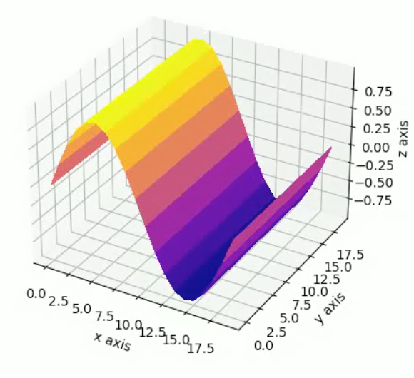

<style>
    .header-img {
        max-width: 400px;
    }
</style>

# Fluid Surface Estimation 💦




Fluid surface height map estimation outputs the next frame in a series of heightmaps.

## Getting started

#### Clone this repository 
```
git clone https://github.com/poly-ai/fluid-surface-estimation.git
```

Navigate into the source directory
```
cd ./fluid-surface-estimation
```

#### Use a virtual environment
Use the [venv](https://docs.python.org/3/library/venv.html) module to create a virtual environment. Note that `/env` is included in `.gitignore`.
```
python3 -m venv ./env
```

Activate the virtual environment. See the [venv docs](https://docs.python.org/3/library/venv.html) on how to do this on different systems.

```
source env/bin/activate
```

#### Install requirements
```
pip install -r requirements.txt
```


## Project Organization
```
├── LICENSE
├── Makefile           <- Makefile with commands like `make data` or `make train`
├── README.md          <- The top-level README for developers using this project.
├── data
│   ├── external       <- Data from third party sources.
│   ├── interim        <- Intermediate data that has been transformed.
│   ├── processed      <- The final, canonical data sets for modeling.
│   └── raw            <- The original, immutable data dump.
│
├── docs               <- A default Sphinx project; see sphinx-doc.org for details
│
├── models             <- Trained and serialized models, model predictions, or model summaries
│
├── notebooks          <- Jupyter notebooks. Naming convention is a number (for ordering),
│                         the creator's initials, and a short `-` delimited description, e.g.
│                         `1.0-jqp-initial-data-exploration`.
│
├── references         <- Data dictionaries, manuals, and all other explanatory materials.
│
├── reports            <- Generated analysis as HTML, PDF, LaTeX, etc.
│   └── figures        <- Generated graphics and figures to be used in reporting
│
├── requirements.txt   <- The requirements file for reproducing the analysis environment, e.g.
│                         generated with `pip freeze > requirements.txt`
│
├── setup.py           <- makes project pip installable (pip install -e .) so src can be imported
├── src                <- Source code for use in this project.
│   ├── __init__.py    <- Makes src a Python module
│   │
│   ├── data           <- Scripts to download or generate data
│   │   └── make_dataset.py
│   │
│   ├── features       <- Scripts to turn raw data into features for modeling
│   │   └── build_features.py
│   │
│   ├── models         <- Scripts to train models and then use trained models to make
│   │   │                 predictions
│   │   ├── predict_model.py
│   │   └── train_model.py
│   │
│   └── visualization  <- Scripts to create exploratory and results oriented visualizations
│       └── visualize.py
│
└── tox.ini            <- tox file with settings for running tox; see tox.readthedocs.io
```

## Contributors

* [@jfaro](https://github.com/jfaro)
* [@jordan787878](https://github.com/jordan787878)
* [@mfro](https://github.com/mfro)
* [@shworsh](https://github.com/shworsh): Sam Worsham
* [@wolfm](https://github.com/wolfm)
