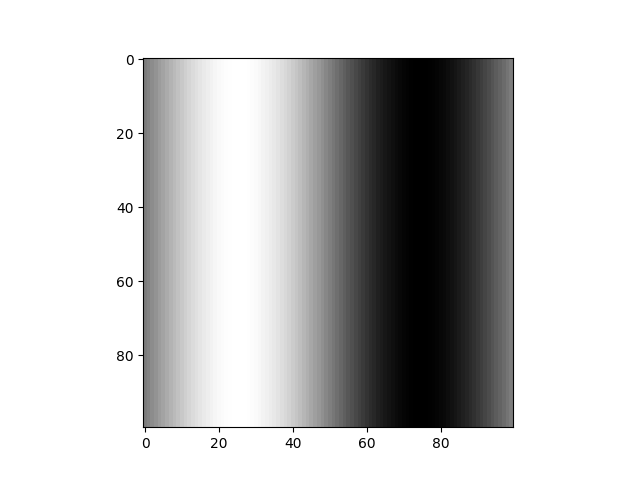

# 1D Advection and Diffusion Wave in 2D domain 
The code generates simple training data.

## Run Code and Extract Training Data (Advection: wave travelling)
```
python3 adv-wave.py
```

## Run Code and Extract Training Data (Diffusion: wave spreading)
```
python3 dif-wave.py
```

## Run Code and Visualize Data (Take Inputs as the .npy files)
```
python3 anim-wave.py
```

## Output Training Data Format
x-train-adv.npy stores the x-train for Advection Wave.
y-train-adv.npy stores the y-train for Advection Wave.
x-train-dif.npy stores the x-train for Diffusion Wave.
y-train-dif.npy stores the y-train for Diffusion Wave.

## Training Data Structure
```
x-train = (example, frame height, frame width, num samples) // where num samples = 3 currently
```
```
y-train = (example, frame height, frame width)
```

So, the i-th training data pair `(X(i),Y(i))` is

`X-train[i,:,:,:]`

`Y-train[i,:,:]`

## Visualize i-th Training Data
Consider the i-th Training Data. (ex/ i = 0)

The Training Input Data X(i) with 3 frames is:

```
X-train[i,:,:,0], 
X-train[i,:,:,1],
X-train[i,:,:,2]
```

 
 


The Training Label Data Y(i) is:

`Y-train[i,:,:]`

 

Note that the difference between the plots is small, because the time step between each frame is small (1/100 sec)

## Objective
Given i-th Training Input Data, predict i-th Training Label Data.

## Animation
4 animations are shown, Adv-1, Adv-5, Dif-1, Dif-2


