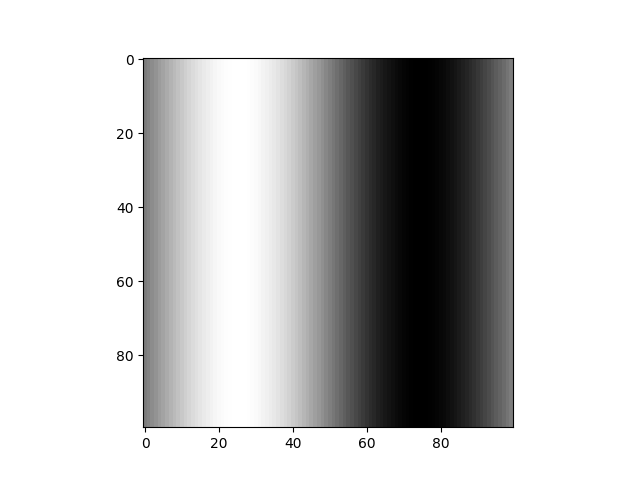

# 1D Advection and Diffusion Wave in 2D domain 
The code generates simple training data.

## Run Code and Extract Training Data (Advection: wave travelling)
```
python3 Adv_Wave.py
```

## Run Code and Extract Training Data (Diffusion: wave spreading)
```
python3 Dif_Wave.py
```

## Run Code and Visualize Data (Take Inputs as the .npy files)
```
python3 Anim_Wave.py
```

## Output Training Data Format
X_train_Adv.npy stores the X_Train for Advection Wave.
Y_train_Adv.npy stores the Y_train for Advection Wave.
X_train_Dif.npy stores the X_train for Diffusion Wave.
Y_train_Dif.npy stores the Y_train for Diffusion Wave.

## Training Data Structure
X_train = (time,(Height in 2D X,Y Square Grid),Nsample), where Nsample = 3 currently

Y_train = (time,(Height in 2D X,Y Square Grid))

So, the i-th training data pair (X(i),Y(i)) is

X_train[i,:,:,:];

Y_train[i,:,:];

## Visualize i-th Training Data
Consider the i-th Training Data. (ex/ i = 0)

The Training Input Data X(i) with 3 frames is:

X_train[i,:,:,0], X_train[i,:,:,1], X_train[i,:,:,2]

 
 


The Training Label Data Y(i) is:

Y_train[i,:,:]

 

Note that the difference between the plots is small, because the time step between each frame is small (1/100 sec)

## Objective
Given i-th Training Input Data, predict i-th Training Label Data.

## Animation
4 animations are shown, Adv_1, Adv_5, Dif_1, Dif_2


